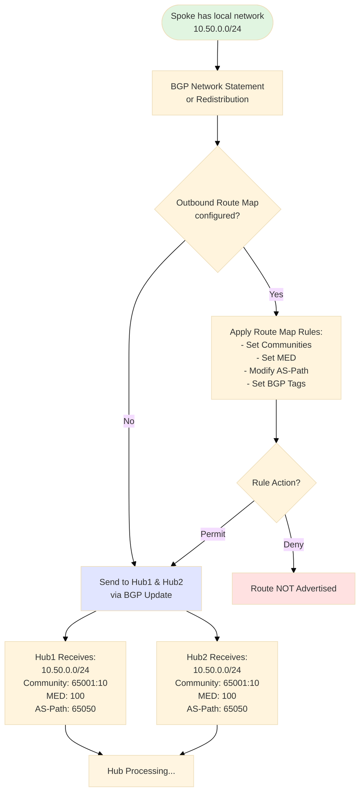
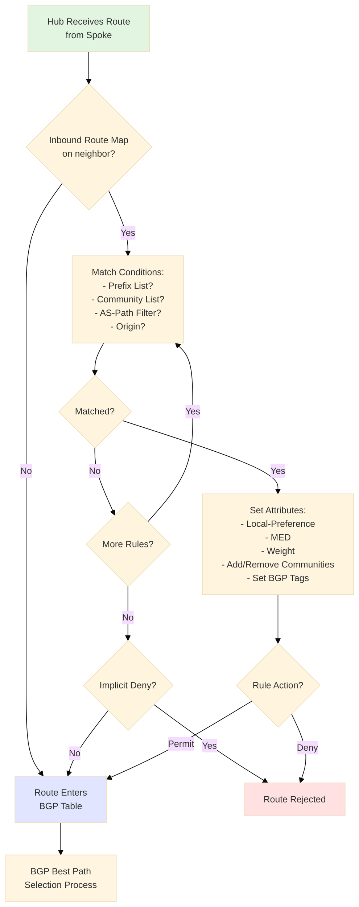
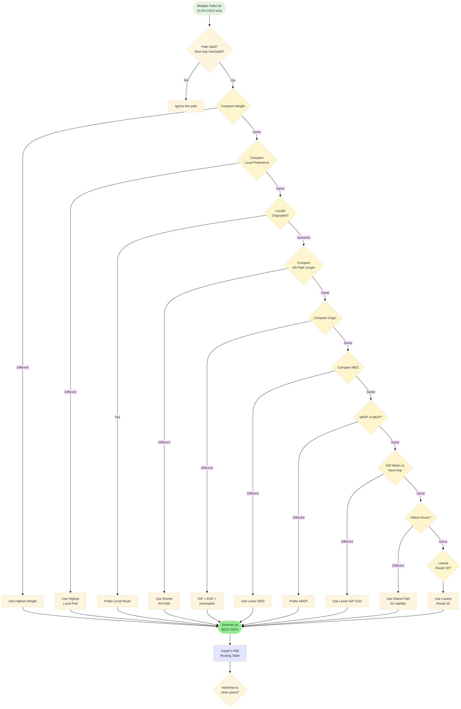
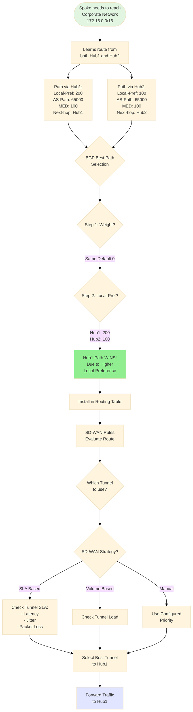
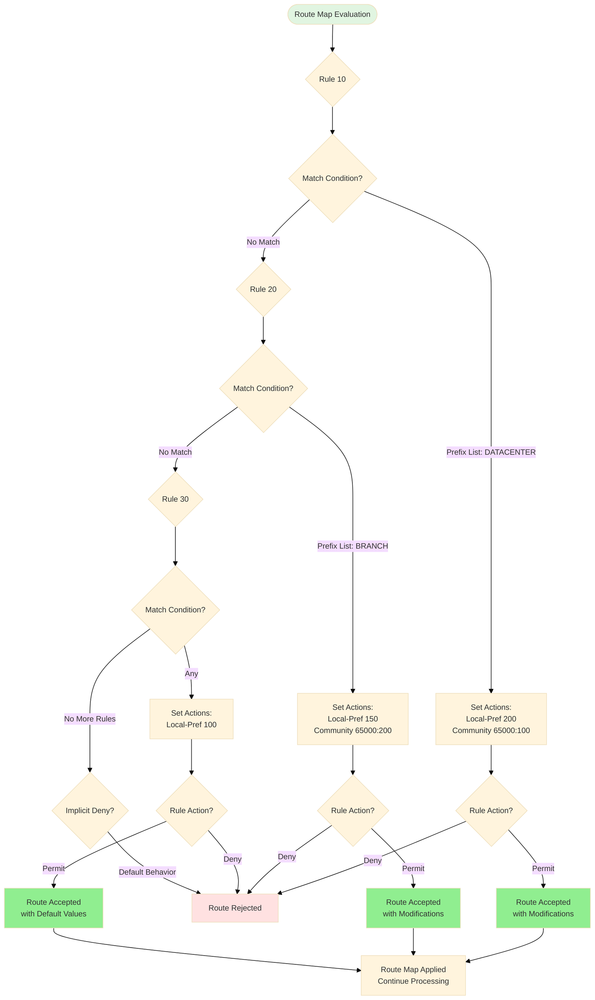
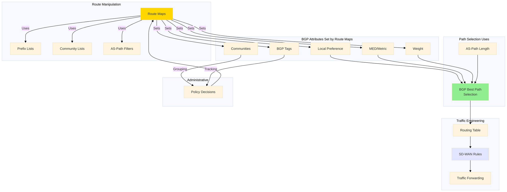

# BGP Operations in Fortinet SD-WAN: Complete Flowchart Guide

## 1. BGP Route Advertisement Flow (Spoke to Hub)

This shows how a spoke advertises its local networks to the hubs, including the application of outbound route maps that can set communities, MED values, and other BGP attributes.

### Key Points:

- **Network Statement:** Defines which local networks to advertise via BGP
- **Outbound Route Map:** Applied before sending to neighbors, modifies BGP attributes
- **Communities:** Tags for grouping routes (e.g., by site type or region)
- **MED:** Suggests to neighbors which path they should prefer
- **Redundancy:** Spokes advertise to both hubs for resilience

## 2. BGP Route Reception & Processing (At Hub)

When hubs receive routes from spokes, they apply inbound route maps that can filter routes and modify attributes before adding them to the BGP table.

### Key Points:

- **Inbound Route Map:** Applied when routes arrive from BGP neighbors
- **Match Conditions:** Prefix lists, community lists, AS-path filters determine which routes to process
- **Sequential Processing:** Route map rules evaluated in order until a match is found
- **Set Attributes:** Local-Preference, MED, Weight, Communities, and BGP Tags can be modified
- **Permit/Deny:** After matching and setting attributes, the rule action determines if the route is accepted
- **Implicit Deny:** Without a final permit rule, unmatched routes may be rejected (depends on configuration)

## 3. BGP Best Path Selection Process

This is the core algorithm BGP uses to choose the best path when multiple routes to the same destination exist. The algorithm is deterministic and follows a strict order.

### Key Points (In Order of Priority):

- **1. Weight:** Cisco/Fortinet local attribute (higher wins) - not standard BGP
- **2. Local-Preference:** Most important in SD-WAN! (higher wins, default 100)
- **3. Locally Originated:** Prefer routes you created yourself
- **4. AS-Path:** Shorter path wins (fewer AS hops)
- **5. Origin:** IGP (network cmd) > EGP > Incomplete (redistribute)
- **6. MED:** Lower wins (default 0) - only compared from same AS
- **7. eBGP > iBGP:** External peers preferred over internal
- **8. IGP Metric:** Lower cost to BGP next-hop wins
- **9. Age:** Older route preferred for stability
- **10. Router ID:** Tiebreaker - lowest router ID wins

## 4. Spoke Path Selection (Hub1 vs Hub2)

A practical example showing how a spoke chooses between two hub paths, and how that selection integrates with SD-WAN forwarding decisions.

### Key Points:

- **Local-Preference is King:** This is the primary tool for hub selection in SD-WAN
- **Set at Spoke:** Inbound route maps on spoke set different local-pref per hub
- **BGP to Routing Table:** Best path is installed in the RIB
- **SD-WAN Integration:** SD-WAN rules then use the routing table to make forwarding decisions
- **Tunnel Selection:** Even after BGP picks the hub, SD-WAN picks which tunnel to that hub based on SLA

## 5. Complete SD-WAN Scenario: Spoke to Datacenter Traffic

This comprehensive diagram shows the complete journey: from route advertisement, through hub processing, spoke path selection, and final traffic forwarding.

```mermaid
%%{init: {'theme':'base', 'themeVariables': {'fontSize':'14px'}, 'flowchart':{'useMaxWidth':false, 'htmlLabels':true}}}%%
flowchart TD
    Spoke(["Spoke Site:<br/>AS 65050<br/>10.50.0.0/24"]) --> |BGP Peering| Hub1["Hub1:<br/>AS 65000"]
    Spoke --> |BGP Peering| Hub2["Hub2:<br/>AS 65000"]

    Hub1 --> |BGP Peering| Core["Core Network:<br/>172.16.0.0/16"]
    Hub2 --> |BGP Peering| Core

    subgraph "Step 1: Route Advertisement"
        A1["Spoke advertises<br/>10.50.0.0/24"] --> A2["Outbound Route Map:<br/>Set Community 65001:50<br/>Set MED 100"]
        A2 --> A3["Sent to Hub1 & Hub2"]
    end

    subgraph "Step 2: Hub Processing"
        B1["Hub1 receives route"] --> B2["Inbound Route Map:<br/>Match Community 65001:50<br/>Set Local-Pref 150"]
        B2 --> B3["Install in BGP table"]

        B4["Hub2 receives route"] --> B5["Inbound Route Map:<br/>Match Community 65001:50<br/>Set Local-Pref 150"]
        B5 --> B6["Install in BGP table"]
    end

    subgraph "Step 3: Core Route Learning"
        C1["Hub1 advertises<br/>172.16.0.0/16 to Spoke"] --> C2["Outbound Route Map:<br/>Set MED 50<br/>Next-hop-self"]

        C3["Hub2 advertises<br/>172.16.0.0/16 to Spoke"] --> C4["Outbound Route Map:<br/>Set MED 150<br/>Next-hop-self"]
    end

    subgraph "Step 4: Spoke Path Selection"
        D1["Spoke receives routes<br/>from both Hubs"] --> D2["Inbound Route Map on Hub1:<br/>Set Local-Pref 200"]
        D1 --> D3["Inbound Route Map on Hub2:<br/>Set Local-Pref 100"]

        D2 --> D4{"BGP Decision:<br/>Local-Pref 200 vs 100"}
        D3 --> D4

        D4 --> D5["Hub1 Path Selected!<br/>Best Path to 172.16.0.0/16"]
    end

    subgraph "Step 5: SD-WAN Forwarding"
        E1["SD-WAN Rule evaluates<br/>destination 172.16.0.0/16"] --> E2["Matches BGP route<br/>via Hub1"]
        E2 --> E3["Check available tunnels<br/>to Hub1"]
        E3 --> E4{"SLA Metrics OK?"}
        E4 -->|Yes| E5["Forward via<br/>Primary Tunnel"]
        E4 -->|No| E6["Forward via<br/>Backup Tunnel"]
    end

    style Spoke fill:#e1f5e1
    style Hub1 fill:#e1e5ff
    style Hub2 fill:#e1e5ff
    style Core fill:#ffe1e1
    style D5 fill:#90EE90
    style E5 fill:#90EE90
```

### Complete Flow Summary:

- **Step 1:** Spoke tags and advertises its local networks to both hubs
- **Step 2:** Hubs receive, match communities, and install routes
- **Step 3:** Hubs advertise core/datacenter routes back to spoke with different MEDs
- **Step 4:** Spoke uses local-preference to select Hub1 as preferred path
- **Step 5:** SD-WAN forwarding uses the BGP route and selects best tunnel based on SLA

## 6. Route Map Decision Tree

Route maps are evaluated sequentially, rule by rule. This shows how a route progresses through multiple rules until it's either accepted with modifications or rejected.

### Key Points:

- **Sequential Processing:** Rules evaluated in numerical order (10, 20, 30, etc.)
- **First Match Wins:** Once a rule matches and permits/denies, processing stops
- **Match Then Set:** If match conditions are met, set actions are applied
- **Permit vs Deny:** After setting attributes, the rule action determines if route is accepted
- **Implicit Deny:** Routes that don't match any rule may be denied (depends on config)
- **Catch-All Rule:** Last rule typically matches "any" to provide default behavior

## 7. Hub Failover Scenario

What happens when your primary hub fails? This shows the BGP convergence process and how traffic automatically fails over to the backup hub, then reconverges when the primary recovers.

```mermaid
%%{init: {'theme':'base', 'themeVariables': {'fontSize':'14px'}, 'flowchart':{'useMaxWidth':false, 'htmlLabels':true}}}%%
flowchart TD
    Normal(["Normal Operation:<br/>All traffic via Hub1"]) --> Failure{"Hub1 Tunnel<br/>Fails"}

    Failure -->|Tunnel Down| BGPDead{"BGP Session<br/>Status"}

    BGPDead -->|"Hold Timer Expires<br/>180 seconds default"| Withdraw["Hub1 Path Withdrawn<br/>from BGP Table"]

    Withdraw --> Reconverge["BGP Reconvergence"]

    Reconverge --> NewBest["Hub2 Path now<br/>BEST PATH"]

    NewBest --> Update["Update Routing Table"]

    Update --> SDWANSwitch["SD-WAN switches<br/>to Hub2 tunnels"]

    SDWANSwitch --> Traffic["Traffic flows<br/>via Hub2"]

    Traffic --> Monitor{"Monitoring Hub1"}

    Monitor --> Recovery{"Hub1 Recovers?"}

    Recovery -->|Tunnel Up| BGPUp["BGP Session<br/>Re-establishes"]

    BGPUp --> ReadvertiseHub1["Hub1 Advertises<br/>Routes Again"]

    ReadvertiseHub1 --> CompareAgain["BGP Compares:<br/>Hub1 Local-Pref 200<br/>Hub2 Local-Pref 100"]

    CompareAgain --> BackToHub1["Hub1 Becomes<br/>Best Path Again"]

    BackToHub1 --> PreemptTime{"Preemption<br/>Delay?"}

    PreemptTime -->|Optional Timer| Wait["Wait for Stability"]
    PreemptTime -->|Immediate| Switchback

    Wait --> Switchback["Traffic Switches<br/>Back to Hub1"]

    Switchback --> Normal

    style Normal fill:#90EE90
    style Failure fill:#FFD700
    style Withdraw fill:#FFA500
    style SDWANSwitch fill:#e1e5ff
    style BackToHub1 fill:#90EE90
```

### Key Points:

- **Failure Detection:** BGP hold timer (default 180s) must expire before routes are withdrawn
- **Faster Detection:** Consider tuning BGP timers (e.g., 10/30) for quicker failover
- **Automatic Failover:** BGP automatically selects next-best path (Hub2)
- **Zero Touch Recovery:** When Hub1 returns, BGP automatically reconverges
- **Preemption:** Can add dampening timers to prevent flapping during unstable periods
- **SD-WAN Integration:** BGP provides the path, SD-WAN provides tunnel-level resilience

## 8. Component Relationships

This high-level diagram shows how all the BGP components interconnect and influence each other in an SD-WAN deployment.

### Understanding the Relationships:

- **Route Maps are Central:** They're the configuration tool that ties everything together
- **Match Tools:** Prefix lists, community lists, and AS-path filters are used by route maps to identify potential routes
- **Set Actions:** Route maps modify BGP attributes that influence path selection
- **Best Path Algorithm:** Uses the attributes set by route maps to choose optimal paths
- **Communities & Tags:** Used for administrative purposes and policy decisions
- **Final Output:** Best paths go into routing table, which SD-WAN uses for forwarding

## Usage Notes

1. **Route Advertisement**: Shows how routes leave a spoke with attributes
2. **Route Reception**: How hubs process incoming routes with route maps
3. **Best Path Selection**: The complete algorithm BGP uses
4. **Spoke Decision**: How spokes choose between multiple hubs
5. **Complete Flow**: End-to-end traffic flow with all components
6. **Route Map Logic**: How route map rules are evaluated sequentially
7. **Failover**: What happens when primary path fails
8. **Relationships**: How all components interconnect
